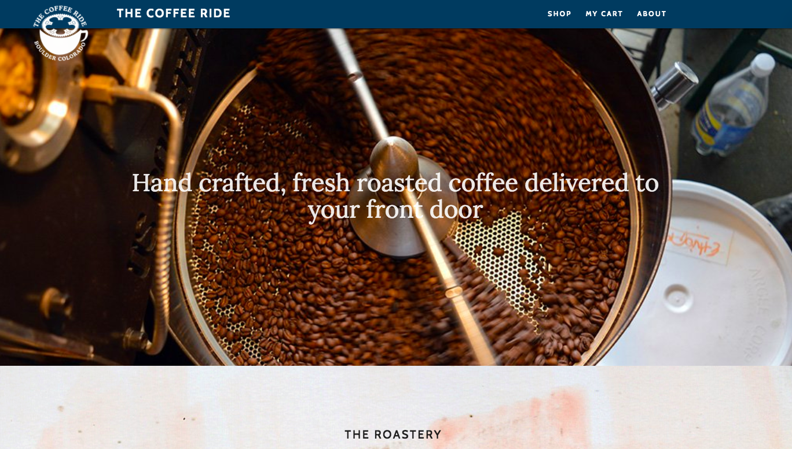
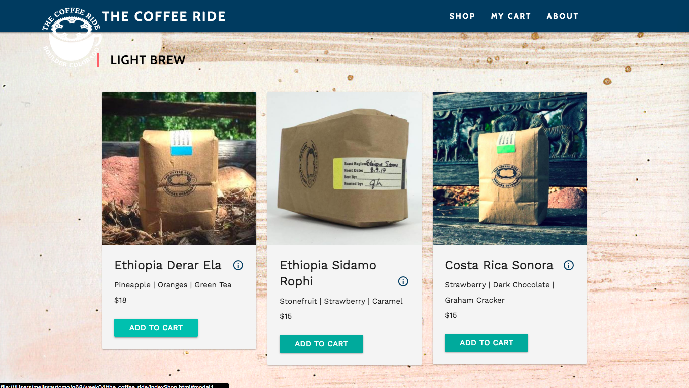
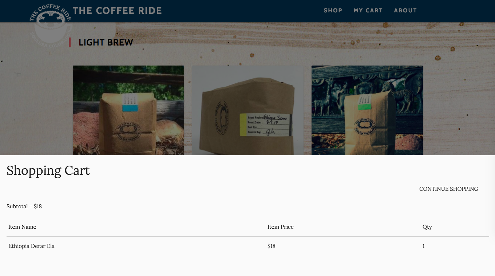
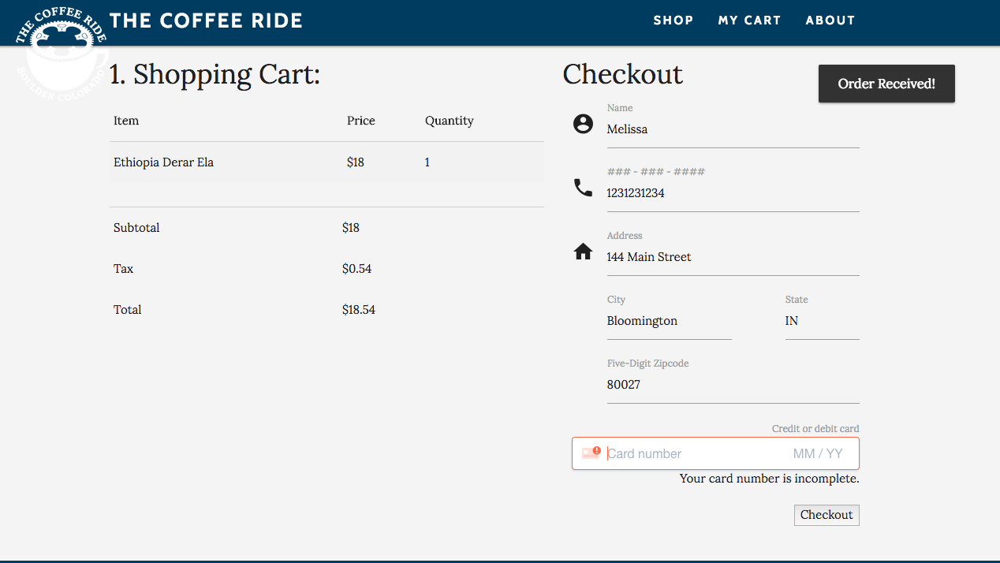

# Quarter 1 Project

###### Surge Link:
Webiste link : thecoffeeride.mutomo.surge.sh

## The Coffee Ride
This is a front-end website that allows users to shop for coffee.

###### Technologies
- HTML5
- CSS
- Javascript
- JQuery
- Materialize
- Local Storage
- Stripe API
- Mocha & Chai

###### Business Background
The Coffee Ride is a real local business in Boulder that delivers quality, ethically sourced coffee via bikes.

###### User Manual
> The Front Page (Home) : This is an overview of the Business

> Shop Tab : Here, users can browse through each coffee selection and add it to their cart by clicking the "Add to Cart" button. A modal will appear at the bottom of the screen showing a preview of their current shopping cart. If the user has previously visited the site, the site will remember their cart from the previous sessions. Users can also ready more about a specific coffee selection by clicking on the "information" icon.

> My Cart Tab: Users are able to look through a summary of their purchases, fill out a form, and checkout.

Original website:
https://the-coffee-ride-coffee-roasting-co.myshopify.com/
